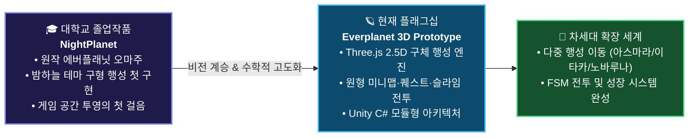

<!--
  🪐 kri2126 GitHub Profile Landing Page & Repository Portal
  GitHub: https://github.com/kri2126
  Repository: https://github.com/kri2126/kri2126
-->

<div align="center">

  <!-- Dynamic Waving Aurora Cosmic Header Banner -->
  

  <!-- Animated Typing SVG Subtitle -->
  <a href="https://github.com/kri2126">
    
  </a>

  <br />

  <!-- Quick Jump Landing Navigation Pills -->
  <p align="center">
    <a href="#-flagship-repository-everplanet-에버플래닛-프로토타입-3d">
      
    </a>
    <a href="https://kri2126.github.io/everplanet/web/evergreen-3d.html" target="_blank">
      
    </a>
    <a href="#-origin-project-nightplanet-나이트플래닛---대학교-졸업작품">
      
    </a>
    <a href="#-the-evolution-nightplanet에서-everplanet으로의-여정">
      
    </a>
  </p>

</div>

---

### 🌌 Welcome to kri2126's Cosmic Hub

> **"지평선 너머로 펼쳐지는 둥근 별의 모험과 시스템 아키텍처를 코딩합니다."**

안녕하세요! 게임의 본질적인 조작감과 공간 투영 수학, 그리고 탄탄한 객체지향 소프트웨어 설계를 탐구하는 개발자 **kri2126**의 GitHub 포털입니다.  
이 페이지는 제가 개발해온 **핵심 프로젝트들(NightPlanet ➜ Everplanet 3D)로 바로 연결되는 중앙 랜딩 게이트웨이**입니다.

---

## 🧭 Projects & Repositories Landing Directory (저장소 포털 목록)

아래의 카드를 클릭하시면 해당 프로젝트와 저장소로 바로 랜딩(이동)하실 수 있습니다.

| 프로젝트 / 저장소 | 기술 스택 | 설명 & 링크 | 바로가기 |
| :--- | :--- | :--- | :---: |
| 🪐 **[kri2126 / everplanet](https://github.com/kri2126/everplanet)** | `Three.js` `WebGL / 2.5D` `Unity (C#)` | **에버플래닛 프로토타입 (Flagship - 3D판)**<br>Three.js 구체 지형 + 2D 빌보드 2.5D 행성 탐험 & 슬라임 전투 | [**저장소 방문 ↗**](https://github.com/kri2126/everplanet) |
| 🌙 **[NightPlanet (Origin)]** | `Graduation Capstone` `Game Design` | **나이트플래닛 (대학교 졸업작품)**<br>원작 에버플래닛의 둥근 구형 세계관에 매료되어 시작된 첫 행성 구현 프로젝트 | [**상세 보기 ↓**](#-origin-project-nightplanet-나이트플래닛---대학교-졸업작품) |
| 🎮 **[Live Demo: 에버그린 3D판](https://kri2126.github.io/everplanet/web/evergreen-3d.html)** | `Three.js 2.5D` `Web Standard` | **브라우저 즉시 3D 플레이**<br>무설치 웹 3D 구체 행성 탐사, NPC 퀘스트, 슬라임 퇴치, 착륙 컷신 | [**3D 데모 플레이 ↗**](https://kri2126.github.io/everplanet/web/evergreen-3d.html) |

---

### 🪐 Flagship Repository: [everplanet (에버플래닛 프로토타입 3D)](https://github.com/kri2126/everplanet)

<div align="center">

```
   ┌──────────────────────────────────────────────────────────────────┐
   │  🌐 [Live 3D Play] 브라우저에서 즉시 조작해 볼 수 있는 3D 라이브 데모! │
   │  https://kri2126.github.io/everplanet/web/evergreen-3d.html      │
   └──────────────────────────────────────────────────────────────────┘
```

</div>

넥슨의 명작 캐주얼 MMORPG '에버플래닛'의 고유한 세계관과 핵심 메커니즘을 1인 개발 싱글플레이어 프로토타입으로 재탄생시킨 플래그십 프로젝트입니다.

#### 📌 3D판 핵심 기술 하이라이트 (로드맵 6 완성)
- **🪐 Three.js 기반 2.5D 구체 행성 엔진 (`web/evergreen-3d.html`)**:
  - 실제 구체 지형 메시 위에 2D 스프라이트 그림 판(빌보드)을 결합하여, 원작 특유의 따뜻하고 둥근 동화풍 행성 공간감을 웹 3D로 완벽 구현.
- **🗺️ 정밀한 인게임 네비게이션 시스템**:
  - 실시간 지형을 위에서 내려다보는 원형 미니맵, M 전체 구역 지도, MM 전경도(월드맵) 지원.
- **⚔️ 탐험·퀘스트·전투 루프 완성**:
  - 비행선 착륙 컷신, 별내림 천문대 구역 NPC 3인 퀘스트, 슬라임 8마리 배치 및 기본 공격 전투, 별 조각 수집 루프 구현.
- **🏗️ 확장형 Unity C# 시스템 아키텍처 (`Assets/Scripts/`)**:
  - FSM(유한 상태 머신) 기반 적 AI, 싱글턴 `GameManager`, `ScriptableObject` 기반 데이터 주도 설계 완료.

#### 🚀 레포지토리 바로가기 링크:
- [📂 **kri2126 / everplanet 저장소 방문하기**](https://github.com/kri2126/everplanet)
- [🎮 **웹 브라우저에서 '에버그린 3D판' 바로 플레이하기**](https://kri2126.github.io/everplanet/web/evergreen-3d.html)
- [📜 **3D 재구축 로드맵 문서 (roadmap/ROADMAP_6.md)**](https://github.com/kri2126/everplanet/blob/main/roadmap/ROADMAP_6.md)
- [📄 **기획 및 시스템 설계 문서 (DESIGN_DOC.md)**](https://github.com/kri2126/everplanet/blob/main/DESIGN_DOC.md)

---

### 🌙 Origin Project: NightPlanet (나이트플래닛 - 대학교 졸업작품)

> **"모든 행성 탐험의 시작점이자, 에버플래닛 IP를 향한 깊은 존경과 열정을 담았던 졸업작품"**

- **기획 의도 & 배경**:
  - 원작 캐주얼 MMORPG '에버플래닛' 특유의 **‘둥근 작은 행성 위를 걸어 다니는 독창적인 공간감’**에 깊은 영감을 받아, 대학교 졸업작품으로 **NightPlanet**을 기획하고 제작했습니다.
  - 밤하늘과 별빛 테마의 원형 행성을 무대로, 캐릭터 이동과 카메라 추적, 행성 공간 투영 파이프라인의 기초를 정립했습니다.
- **개발 의의**:
  - 단순한 학과 과제를 넘어, **"어떻게 하면 평면 화면에서 둥근 별의 곡률과 지평선 너머의 미지의 세계를 생생하게 전달할 수 있을까?"**라는 질문을 품게 만든 프로젝트입니다.
  - 이 첫 번째 도전에서의 수많은 기술적 고민과 애정이 거름이 되어, 현재의 **`Everplanet 3D Prototype`**으로 눈부시게 이어지게 되었습니다.

---

### 🚀 The Evolution: NightPlanet에서 Everplanet으로의 여정



- **The Spark (NightPlanet)**: 대학교 졸업작품을 통해 원작의 감성과 구형 맵 메커니즘을 탐구하며 게임 프로그래밍의 기초를 닦았습니다.
- **The Evolution (Everplanet 3D)**: 졸업 이후, 웹 캔버스를 거쳐 **Three.js 기반 2.5D 구체 행성 엔진**으로 도약하여 무설치 3D 탐험, 퀘스트, 슬라임 전투를 실현하고 독자적인 실전 포트폴리오로 진화시켰습니다.

---

### 📬 Connect & Landing Links

<div align="center">

  <a href="https://github.com/kri2126">
    
  </a>
  <a href="https://github.com/kri2126/everplanet">
    
  </a>
  <a href="https://kri2126.github.io/everplanet/web/evergreen-3d.html">
    
  </a>
  <a href="#-origin-project-nightplanet-나이트플래닛---대학교-졸업작품">
    
  </a>

  <br><br>
  <sub>kri2126 Cosmic Repository Hub & Landing Page | Crafted with Passion</sub>

</div>
