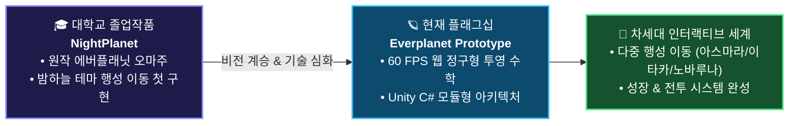

<!--
  🪐 kri2126 GitHub Profile Landing Page & Repository Portal
  GitHub: https://github.com/kri2126
  Repository: https://github.com/kri2126/kri2126
-->

<div align="center">

  <!-- Dynamic Waving Aurora Cosmic Header Banner -->
  

  <!-- Animated Typing SVG Subtitle -->
  <a href="https://github.com/kri2126">
    
  </a>

  <br />

  <!-- Quick Jump Landing Navigation Pills -->
  <p align="center">
    <a href="#-flagship-repository-1-everplanet-프로토타입">
      
    </a>
    <a href="https://kri2126.github.io/everplanet/web/evergreen-exploration.html" target="_blank">
      
    </a>
    <a href="#-repository-2-callram-java-알림-유틸리티">
      
    </a>
    <a href="#-origin-story-대학교-졸업작품-nightplanet에서-everplanet으로">
      
    </a>
  </p>

</div>

---

### 🌌 Welcome to kri2126's Cosmic Hub

> **"지평선 너머로 펼쳐지는 둥근 별의 모험과 시스템 아키텍처를 코딩합니다."**

안녕하세요! 게임의 본질적인 조작감과 공간 투영 수학, 그리고 탄탄한 객체지향 소프트웨어 설계를 탐구하는 개발자 **kri2126**의 GitHub 포털입니다.  
이 페이지는 제가 개발하고 있는 **모든 프로젝트와 공개 레포지토리로 바로 이동할 수 있는 중앙 랜딩 게이트웨이**입니다.

---

## 🧭 Repositories Landing Directory (저장소 포털 목록)

아래의 카드를 클릭하시면 해당 저장소로 바로 랜딩(이동)하실 수 있습니다.

| 저장소 (Repository) | 기술 스택 | 설명 & 링크 | 바로가기 |
| :--- | :--- | :--- | :---: |
| 🪐 **[kri2126 / everplanet](https://github.com/kri2126/everplanet)** | `JavaScript` `Canvas 2D` `Unity (C#)` | **에버플래닛 프로토타입**<br>둥근 행성 정구형 투영 렌더링 + 60FPS 무설치 웹 싱글플레이어 게임 | [**이동 ↗**](https://github.com/kri2126/everplanet) |
| ☕ **[kri2126 / Callram](https://github.com/kri2126/Callram)** | `Java` `OOP` `Event-Driven` | **Callram (알림 유틸리티)**<br>Java 기반 맞춤 스케줄링 및 이벤트 알림 애플리케이션 | [**이동 ↗**](https://github.com/kri2126/Callram) |
| 🎓 **[NightPlanet (Origin)]** | `Graduation Capstone` | **대학교 졸업작품**<br>현재의 everplanet으로 이어진 첫 번째 행성 구현 오마주 프로젝트 | [**스토리 보기 ↓**](#-origin-story-대학교-졸업작품-nightplanet에서-everplanet으로) |

---

### 🪐 Flagship Repository 1: [everplanet (에버플래닛 프로토타입)](https://github.com/kri2126/everplanet)

<div align="center">

```
   ┌──────────────────────────────────────────────────────────────────┐
   │  🌐 [Live Play] 브라우저에서 즉시 조작해 볼 수 있는 라이브 데모!    │
   │  https://kri2126.github.io/everplanet/web/evergreen-exploration.html  │
   └──────────────────────────────────────────────────────────────────┘
```

</div>

넥슨의 명작 캐주얼 MMORPG '에버플래닛'의 고유한 세계관과 핵심 메커니즘을 1인 개발 싱글플레이어 프로토타입으로 재탄생시킨 플래그십 프로젝트입니다.

#### 📌 핵심 기술 하이라이트
- **📐 정구형 투영 렌더링 (Spherical Curvature Projection)**:
  - 플레이어 중심 거리에 따른 비선형 곡률 왜곡 수식을 개발하여, 앞으로 걸어갈수록 둥근 지평선 너머의 숲과 랜드마크가 시야 위로 솟아오르는 원작 특유의 행성 시야를 웹 표준 기술로 재현.
- **⚡ 무설치 60 FPS 순수 Canvas 엔진 (`web/evergreen-exploration.html`)**:
  - 외부 무거운 엔진 없이 순수 HTML5 Canvas & Vanilla JS만으로 60 FPS 부드러운 카메라 팔로우, 타원체 충돌 판정, 벡터 슬라이딩을 구현.
- **🏗️ 확장형 Unity C# 시스템 아키텍처 (`Assets/Scripts/`)**:
  - FSM(유한 상태 머신) 기반 적 AI (`Idle` → `Patrol` → `Chase` → `Attack`), 싱글턴 `GameManager`, `ScriptableObject` 기반 데이터 주도 설계 완료.
- **🗺️ 체계적인 개발 로드맵 완비**:
  - `roadmap/ROADMAP_1.md` ~ `ROADMAP_5.md`까지 단계별 탐험, 전투, 성장, 행성 이동, 저장 시스템 마감 계획 수립.

#### 🚀 레포지토리 바로가기 링크:
- [📂 **kri2126 / everplanet 저장소 방문하기**](https://github.com/kri2126/everplanet)
- [🎮 **웹 브라우저에서 '에버그린 탐사' 바로 플레이하기**](https://kri2126.github.io/everplanet/web/evergreen-exploration.html)
- [📄 **기획 및 시스템 설계 문서 (DESIGN_DOC.md)**](https://github.com/kri2126/everplanet/blob/main/DESIGN_DOC.md)

---

### ☕ Repository 2: [Callram (Java 알림 유틸리티)](https://github.com/kri2126/Callram)

> 객체지향 프로그래밍(OOP) 원칙과 안정적인 이벤트 스케줄링 메커니즘을 적용한 Java 유틸리티 프로젝트입니다.

- **핵심 특징**:
  - 사용자 맞춤형 알림 및 시간 기반 이벤트 트리거 시스템 구현
  - Java 기반의 구조적 클래스 분리 및 신뢰성 높은 백그라운드 스케줄링 로직 확립
- [📂 **kri2126 / Callram 저장소 방문하기**](https://github.com/kri2126/Callram)

---

### 🎓 Origin Story: 대학교 졸업작품 'NightPlanet'에서 'Everplanet'으로



- **The Spark (NightPlanet)**:  
  원작 '에버플래닛'의 둥근 구형 맵 위를 걷는 독창적인 공간감에 매료되어, **대학교 졸업작품으로 'NightPlanet'**을 제작했습니다. 첫 발을 내딛었던 이 프로젝트는 단순한 학과 과제를 넘어 '게임 수학'과 '지평선 너머의 시야 구현'에 일생의 호기심을 갖게 만든 결정적 계기였습니다.
- **The Evolution (Everplanet)**:  
  졸업 이후에도 그 열정은 이어졌습니다. 원작의 감성을 나만의 기술적 도전으로 승화시키고자, 웹 캔버스(HTML5 Canvas/JS) 환경에서의 **정구형 곡률 투영 알고리즘**을 자체 수식으로 정립하고, 대규모 확장을 대비한 **Unity C# 코어 아키텍처**를 완성하여 실전 포트폴리오로 진화시켰습니다.

---

### 🛠️ Tech Stack & Capabilities

<div align="center">

| 분류 | 기술 스택 |
| :--- | :--- |
| **Languages** |      |
| **Game & Math** |     |
| **Tools & CI/CD** |     |

</div>

---

### 📊 GitHub Activity & Real-Time Stats

<div align="center">
  
  <br />
  
</div>

---

### 📬 Connect & Landing Links

<div align="center">

  <a href="https://github.com/kri2126">
    
  </a>
  <a href="https://github.com/kri2126/everplanet">
    
  </a>
  <a href="https://kri2126.github.io/everplanet/web/evergreen-exploration.html">
    
  </a>
  <a href="https://github.com/kri2126/Callram">
    
  </a>

  <br><br>
  <sub>kri2126 Cosmic Repository Hub & Landing Page | Crafted with Passion</sub>

</div>
